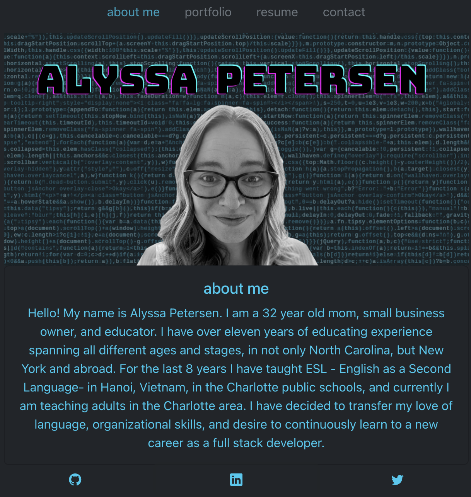
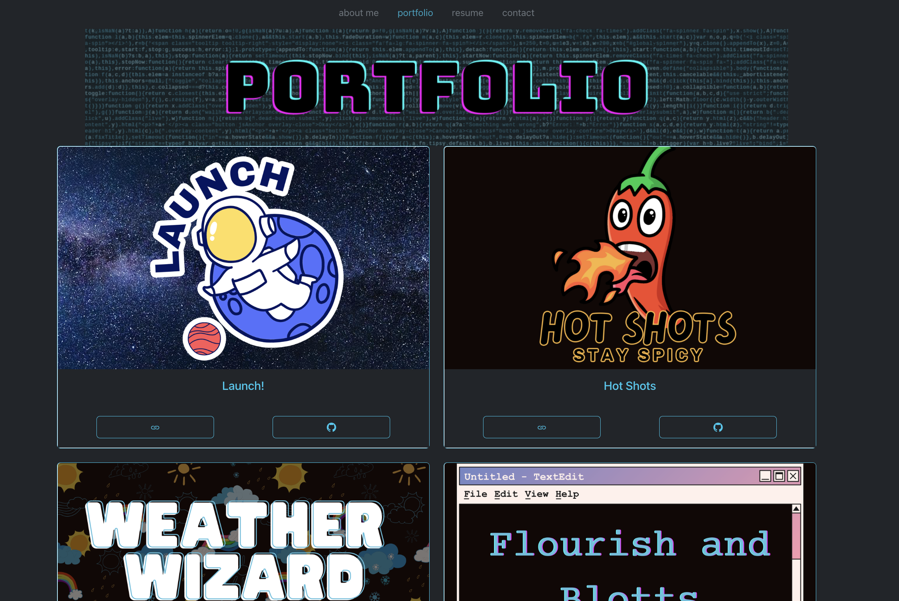
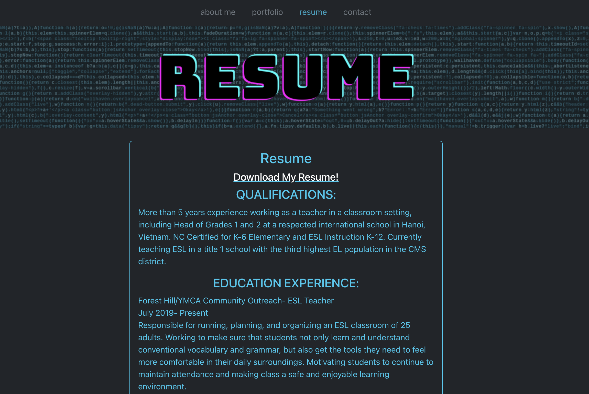
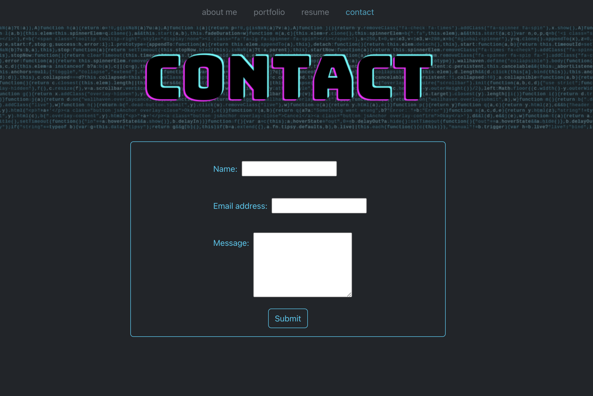

# Alyssa Petersen React Portfolio

This application was built to showcase the work done by Alyssa Petersen and to help potential employees get to know her. It provides a potential employer information about her, examples of her work, a form to contact her, a downloadable resume, as well as several social media profiles to contact her on.

## Table of Contents

- [Usage](#usage)
- [Contributing](#contributing)
- [Questions](#questions)

## Usage

You can use the navigation bar to explore through the page and see the section you are interested in.

## Contributing

Please fork to contribute.

## Questions

If you have questions, please contact me on GitHub here: [APetersen11](https://github.com/APetersen11)
or by email here: [aptrsn11@gmail.com](mailto:aptrsn11@gmail.com)
